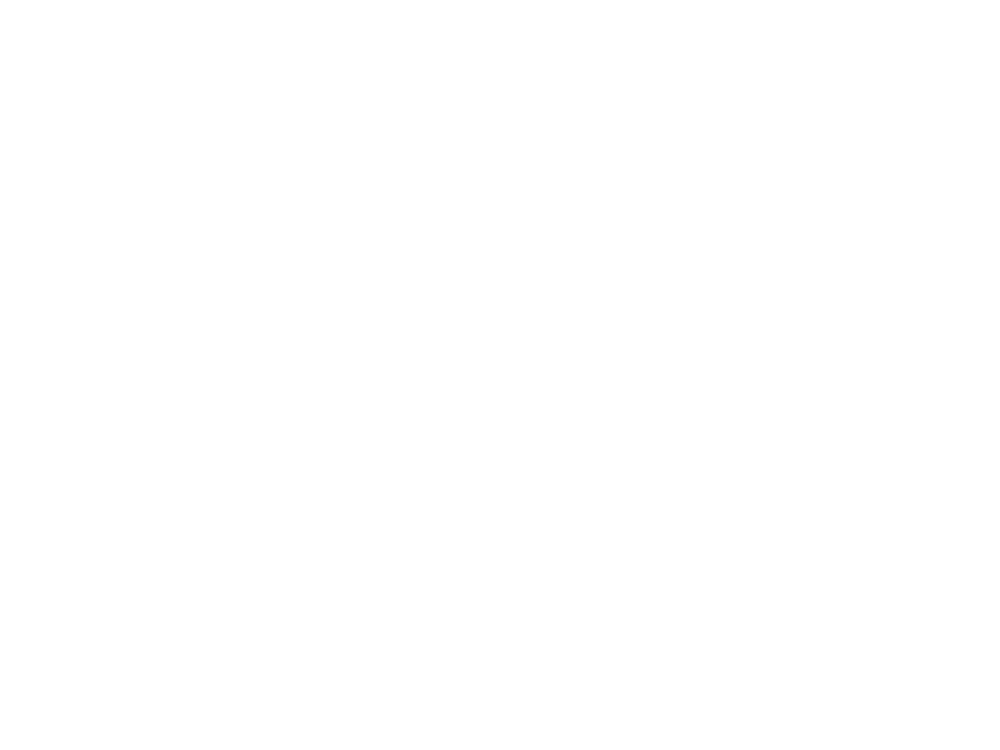
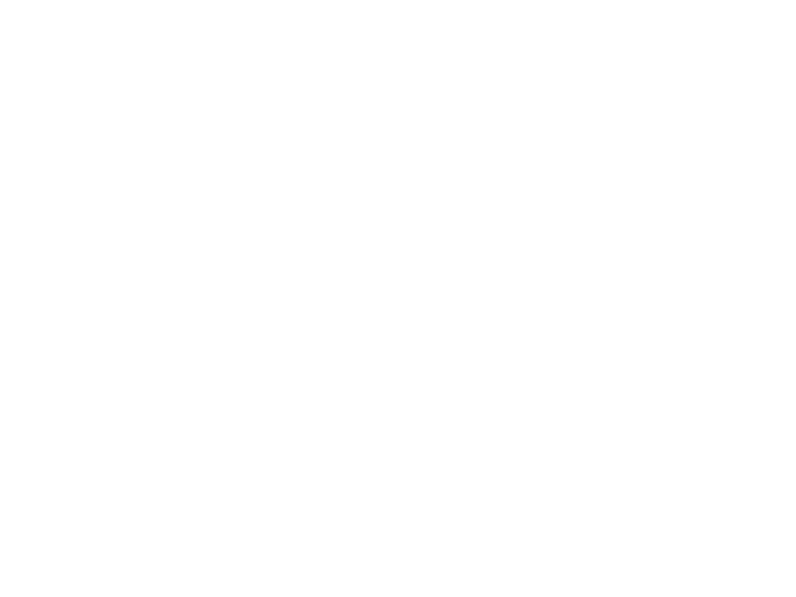

# Implicit Density Estimation using Wasserstein GAN (WGAN)

## Overview

This project demonstrates **learning an unknown probability density function using sample data only**, without assuming any parametric form (e.g., Gaussian).

A nonlinear transformation is applied to real-world NO₂ air quality data, and a **Wasserstein Generative Adversarial Network (WGAN)** is trained to implicitly learn the resulting probability distribution.

The goal is to estimate the underlying probability density purely from data samples.

---

## Problem Statement

Given NO₂ concentration samples `x`, we define a nonlinear transformation:

z = x + a_r sin(b_r x)

where:

- `a_r = 0.5 × (roll_number mod 7)`
- `b_r = 0.3 × ((roll_number mod 5) + 1)`

The objective is to:

- Learn the probability density function of `z`
- Use only samples of `z`
- Avoid assuming Gaussian or any fixed parametric distribution
- Estimate the PDF using a generative model

---

## Why Wasserstein GAN?

Initial experiments using Vanilla GAN showed:

- Mode collapse
- Poor tail coverage
- Training instability

To overcome these issues, **Wasserstein GAN (WGAN)** was implemented.

### Advantages of WGAN:
- Uses Wasserstein distance instead of JS divergence
- More stable gradients
- Reduced mode collapse
- Better modeling of skewed distributions

---

## Model Architecture

### Generator
- Input: Noise sampled from N(0,1)
- Linear(1 → 64)
- ReLU
- Linear(64 → 64)
- ReLU
- Linear(64 → 1)

### Critic
- Linear(1 → 64)
- ReLU
- Linear(64 → 64)
- ReLU
- Linear(64 → 1)
- No sigmoid activation

Weight clipping is used to enforce the Lipschitz constraint.

---

## Training Details

- Optimizer: RMSprop
- Critic updates per generator step: 5
- Weight clipping range: [-0.01, 0.01]
- Data normalized before training
- 20,000 samples used for faster convergence

---

## Results

### Real Distribution

### Real vs Generated Distribution (WGAN)

---

## Observations

- WGAN significantly reduced mode collapse observed in Vanilla GAN.
- Generated distribution closely follows the central mass and skewness.
- Tail behavior improved compared to standard GAN.
- Minor discrepancies remain in extreme tail regions.

---

## Key Learnings

- Vanilla GAN struggles with skewed 1D distributions.
- Wasserstein loss provides more stable training dynamics.
- Proper normalization improves convergence.
- Critic-generator balance is crucial for stable training.

---

## Installation

Install required dependencies:
pip install -r requirements.txt

---

## Running the Project

Place `data.csv` in the project folder and run:

python app.py

The script will:

1. Load and preprocess the dataset
2. Apply nonlinear transformation
3. Train WGAN
4. Save generated distribution plots

---

## Dataset

India Air Quality Dataset (NO₂ concentration values)

Dataset not included in repository due to file size.

---

## Future Improvements

- Implement WGAN-GP (Gradient Penalty)
- Quantitative evaluation using KL divergence
- Hyperparameter tuning
- Larger sample training
- Loss curve visualization

---

## Author

Keshav Sharma  
B.E. Computer Science  
Thapar Institute of Engineering & Technology  